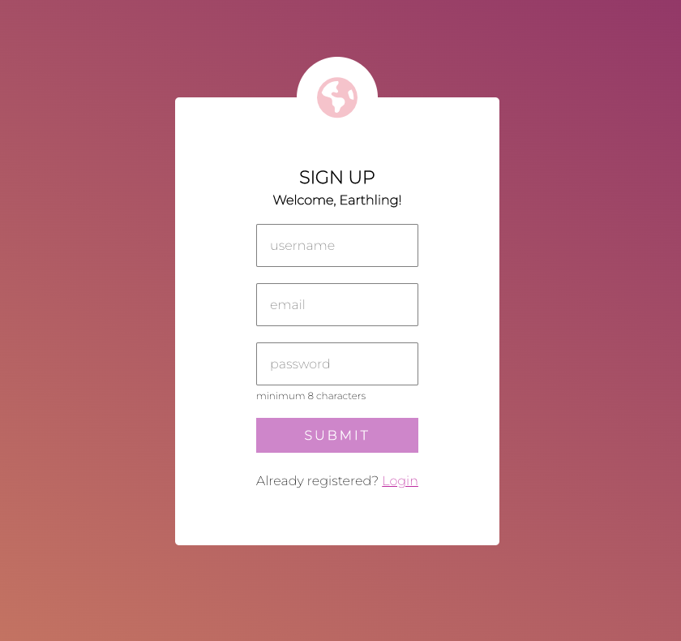

# Josh Neuwford

[Skills](#skills) | [Projects](#projects) | [Education](#education) | [Experience](#experience) | [Contact](#contact)

I am a motivated and ambitous full stack software developer, looking for a role in which I can further develop my existing programming skills and work on exciting and challenging projects, with a view to apply my extensive management and EQ experience to have a postive impact on the team I join.

Whilst studying towards my CS degree, I acheived my goal of becoming a manager at the LUSH global flagship store. I took the opportunity to take on large recruitment projects, and transform the way in which recuitment was managed to become more inclusive and attract the best talent for the business. With over 70 additional team members we then went on to secure the largest increase in sales of any LUSH store in the UK. I then left my job to commit  myself to becoming a software developer and learned to code at Makers Academy, a 16 week software development bootcamp, and have transformed my career to find success as a software developer.

Tech Skills: JavaScript, Node.js, Express, MongoDB, React, Ruby, HTML, CSS, PostgreSQL, Python, C++, C#, TDD

# Skills
  - **Creative thinking** - I focus on understanding things enough so that I can express my ideas and apply my creativity. When that happens I really enjoy finding interesting abstractions that not only enable quick understanding, but ensures that the codebase can grow whilst maintaining cohesion.
  - **EQ** - I pride myself on my ability to create and maintain great working relationships in a safe environment.
  - **Motivation** - I'm able to consistently keep myself positive and focussed. Motivating others was my favourite aspect of my time in management.
  - **Passion for learning** - I take ownership of my own development, and I love taking on new challenges.
  - **Critical thinking** - I love finding solutions to tricky problems. Starting with an ambiguous task that has no fixed solution is when I thrive the most.

# Projects
|Project| Description | Tech | Link |
| :------: | :----: | :---: | :---:|
|**Yahtzee**   | A cyberpunk re-imagining of the classic dice   game, complete with local multiplayer,   leaderboard, and an AI player to compete with! | React, JavaScript   Express, MongoDB,   Node.js, Jest,   Cypress, CakeWalk   Helm, Synth1| https://github.com/J-Neuwford/yahtzee | 
|**Acebook**    | A Facebook clone made in two weeks to learn   how to MERN. Includes token based authentication,   profiles, posts, comments and likes. | React, JavaScript,   Express, Node.js,   MongoDB, Jest   Cypress| https://github.com/Destinek/acebook-earth |
|**Retro Arcade**   | My latest WIP, a collection of retro arcade classics   including Pong, Tetris and Pacman.| Unity, C#|https://github.com/J-Neuwford/RetroArcade |

# Education
## Makers Academy - London - *Graduated May 2023*

The Makers Academy's 16 week bootcamp is famous for its intensity and great results. The course boasts teaching high-quality code and empahasises the importance of EQ and collaboration.

### Highlights: 
 - core developer skills such as debugging, TDD, OOP and pair programming.
 - unit, integration and end-to-end testing.
 - designing, creating and deploying multi and single page web apps. 
 - creating and working with relational and non-relational databases. 
 - making HTTP requests and working with API's

### Technologies:
 - MERN stack - *MongoDB, Express, React, Node.js*
 - Javascript, Ruby
 - RSpec, Jest and Cypress
 - Mongoose, SQL, PostgreSQL
 - Git, Github
 - TablePlus, PostMan, Jira, Trello, Visual Studio Code

## BSc Computer Science, University of London - London - *Expected graduation 2024*
Games develpoment pathway. Studying part-time in a remote cohort whilst working full time has been extremely rewarding, and has been fantastic for my consistent development and growth. 

### Highlights:
 - confident in working with and creating different algorithms and data structures
 - solid understanding of computational and discrete maths
 - OOP and software design
 - graphics prgramming including creating physics engines
 - databases, networks and web development.

### Technologies
 - Visual Studio, Jupyter, Brackets
 - JavaScript, Python, C++, SQL, CSS and HTML

# Experience
## Retail Manager Jan. 2018 – Feb.2023
**LUSH Cosmetics,  London**

- Managed and motivated a passionate team to drive business growth and create a positive work environment at
Lush Oxford Street.
- Oversaw the recruitment and onboarding of 70+ new employees within two months, successfully doubling the team
size for the winter season.
- Trained supervisors on coaching and feedback techniques, promoting open communication and personal
development amongst staff members.
- Prioritized building and maintaining strong relationships to ensure a positive experience and successful outcomes in
all projects.

## Retail Manager Sep. 2017 – Jan.2018
**Games Workshop Group Plc London**
- Demonstrated strong leadership skills by managing all aspects of the store independently, from inventory management to optimizing customer experiences.
- Fostered productive relationships with colleagues and area managers to consistently achieve company targets.

# Contact

**LinkedIn:** https://www.linkedin.com/in/josh-neuwford/

Feel free to connect with me if you want to find out more!

