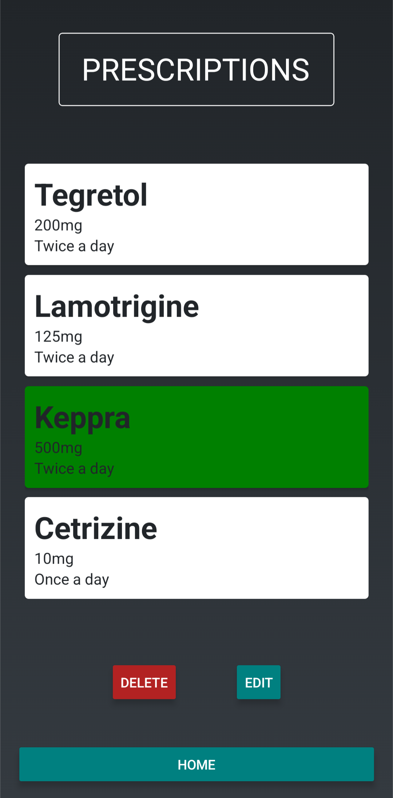
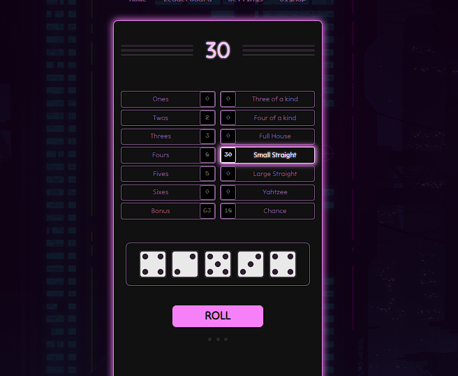
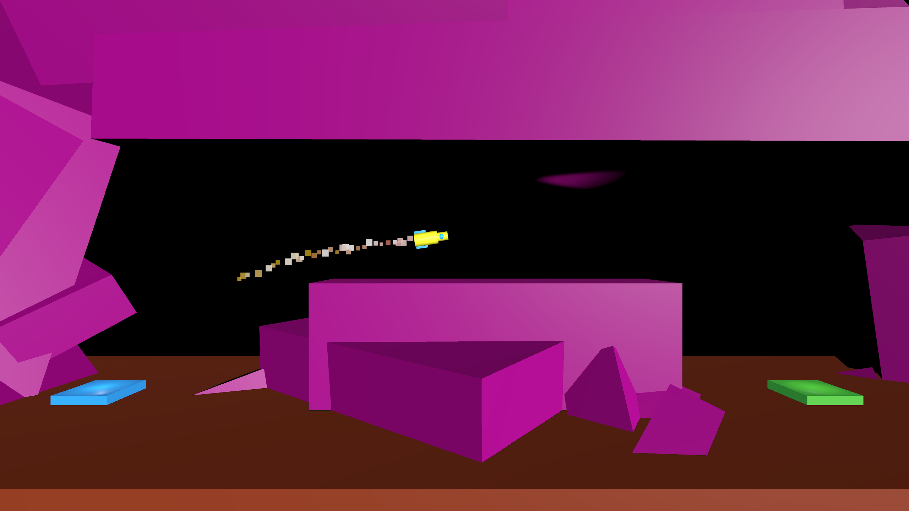

# Josh Neuwford

[Skills](#skills) | [Projects](#projects) | [Education](#education) | [Experience](#experience) | [Contact](#contact)

I am a motivated and ambitous full stack software developer, looking for a role in which I can further develop my existing programming skills and work on exciting and challenging projects, with a view to apply my engineering, management and EQ experience to have a postive impact on the team I join.

For the past year I have been part of the engineering team at Spendesk, working across multiple domains to deliver a payment institution whilst honing my programming skills and my ability to contribute and add value to a fast-paced product, design and engineering squad.

Whilst learning to code, I acheived my goal of becoming a manager at the LUSH global flagship store. I took the opportunity to take on large recruitment projects, and transform the way in which recuitment was managed to become more inclusive and attract the best talent for the business. With over 70 additional team members we then went on to secure the largest increase in sales of any LUSH store in the UK. I then left my job to commit myself to becoming a software developer and learned to code at Makers Academy, a 16 week software development bootcamp, and have transformed my career to find success as a software developer.

Tech Skills: TypeScript, JavaScript, Node.js, Express, MongoDB, React, React Native, HTML, CSS, PostgreSQL, Python, C#, TDD

# Skills

- **Creative thinking** - I focus on understanding things enough so that I can express my ideas and apply my creativity. When that happens I really enjoy finding interesting abstractions that not only enable quick understanding, but ensures that the codebase can grow whilst maintaining cohesion.
- **EQ** - I pride myself on my ability to create and maintain great working relationships in a safe environment.
- **Motivation** - I'm able to consistently keep myself positive and focussed. Motivating others was my favourite aspect of my time in management.
- **Passion for learning** - I take ownership of my own development, and I love taking on new challenges.
- **Critical thinking** - I love finding solutions to tricky problems. Starting with an ambiguous task that has no fixed solution is when I thrive the most.

# Projects

|                                    Project                                    |                                                                 Description                                                                  |                                                 Tech                                                  |                        Link                        |
| :---------------------------------------------------------------------------: | :------------------------------------------------------------------------------------------------------------------------------------------: | :---------------------------------------------------------------------------------------------------: | :------------------------------------------------: |
| **Prescription Tracker**    |                                A mobile app to keep track of prescriptions and schedule medication reminders.                                |                      TypeScript, React Native, Python, Quart, PostgreSQL, SQLite                      | https://github.com/J-Neuwford/prescription-tracker |
|             **Yahtzee**                 | A cyberpunk re-imagining of the classic dice   game, complete with local multiplayer,   leaderboard, and an AI player to compete with! | React, JavaScript   Express, MongoDB,   Node.js, Jest,   Cypress, CakeWalk   Helm, Synth1 |       https://github.com/J-Neuwford/yahtzee        |
|          **RocketRoll**              |                        A physics-based game in which the player pilots a malfunctoining rocket with limited controls.                        |                                               Unity, C#                                               |      https://github.com/J-Neuwford/RocketRoll      |

# Education

## Makers Academy - London - _Graduated May 2023_

The Makers Academy's 16 week bootcamp is famous for its intensity and great results. The course boasts teaching high-quality code and empahasises the importance of EQ and collaboration.

### Highlights:

- core developer skills such as debugging, TDD, OOP and pair programming.
- unit, integration and end-to-end testing.
- designing, creating and deploying multi and single page web apps.
- creating and working with relational and non-relational databases.
- making HTTP requests and working with API's

### Technologies:

- MERN stack - _MongoDB, Express, React, Node.js_
- Javascript, Ruby
- RSpec, Jest and Cypress
- Mongoose, SQL, PostgreSQL
- Git, Github
- TablePlus, PostMan, Jira, Trello, Visual Studio Code

# Experience

## Junior Software Engineer. Oct. 2023 - Oct. 2024

**Spendesk**

- Delivered fully tested UI improvements, including custom customer search components and breadcrumb navigation, increasing efficiency across the back-office application.
- Improved and maintained backend systems within a domain-driven environment, contributing to new features and ensuring compliance with financial authorities. This included database migrations, creating and updating API endpoints, and ensuring thorough validation and testing.
- Actively contributed to squad rituals and technical workshops, including hosting refactoring workshops to identify and prioritise improvements to our domains to increase the squad's rate of delivery.

### Technologies:

- TypeScript, React, Tailwind
- Node, Koa, PostgreSQL
- Github, GitHub Actions, PostMan, Jira, Whimsical, Visual Studio Code

## Retail Manager Jan. 2018 – Feb. 2023

**LUSH Cosmetics, London**

- Managed and motivated a passionate team to drive business growth and create a positive work environment at
  Lush Oxford Street.
- Oversaw the recruitment and onboarding of 70+ new employees within two months, successfully doubling the team
  size for the winter season.
- Trained supervisors on coaching and feedback techniques, promoting open communication and personal
  development amongst staff members.
- Prioritized building and maintaining strong relationships to ensure a positive experience and successful outcomes in
  all projects.

## Retail Manager Sep. 2017 – Jan. 2018

**Games Workshop Group Plc London**

- Demonstrated strong leadership skills by managing all aspects of the store independently, from inventory management to optimizing customer experiences.
- Fostered productive relationships with colleagues and area managers to consistently achieve company targets.

# Contact

**LinkedIn:** https://www.linkedin.com/in/josh-neuwford/

Feel free to connect with me if you want to find out more!
